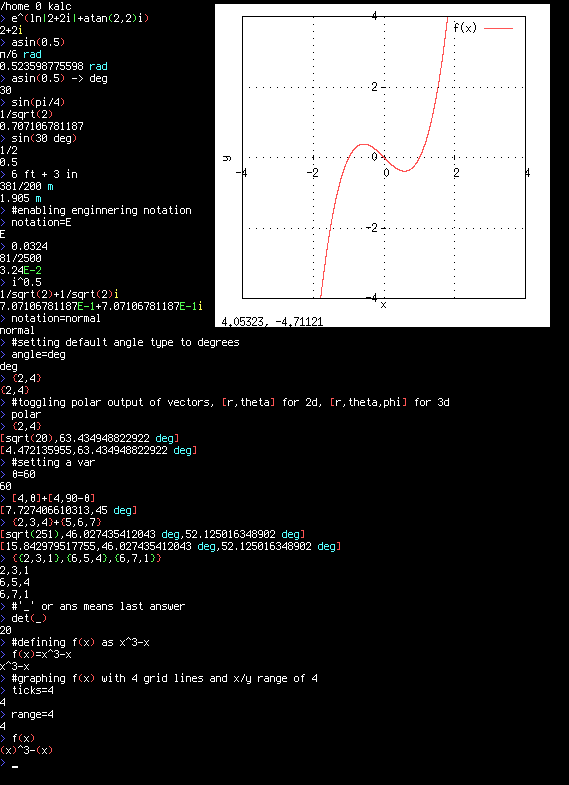

# kalc

[](https://crates.io/crates/kalc) [](https://aur.archlinux.org/packages/kalc/)



history file is stored in [config_dir](https://docs.rs/dirs/latest/dirs/fn.config_dir.html)/kalc/kalc.history

config file is stored in [config_dir](https://docs.rs/dirs/latest/dirs/fn.config_dir.html)/kalc/kalc.config example in
repo

you can set permanent variables and functions in the
file [config_dir](https://docs.rs/dirs/latest/dirs/fn.config_dir.html)/kalc/kalc.vars example in repo, also contains
more advanced example usage

config defaults listed in kalc.config

# install instructions

### linux

use aur or run
```cargo install kalc```

### windows

download kalc.exe from https://github.com/bgkillas/kalc/releases/latest

needs a modern terminal like 'windows terminal' or alacritty, alacritty has better latency seemingly

for graphing install gnuplot via winget or [sourceforge](https://sourceforge.net/projects/gnuplot/files/gnuplot/)

### macos

install developer tools via ```xcode-select --install```

```cargo install kalc```

install gnuplot via ```brew install gnuplot```

may need to run kalc from ```kalc 2> /dev/null``` for gnuplot not to output error messages

# build instructions

if build fails due to gmp-mpfr-sys try changing the line
`features = ["force-cross"]`
to
`features = ["use-system-libs"]`
at the end of cargo.toml

### linux

dependencys are: rust>=1.79.0, diffutils, gcc, m4, make

```
git clone https://github.com/bgkillas/kalc
cd kalc
cargo build --release
./target/release/kalc
```

### windows

have cargo and the toolchain ```stable-x86_64-pc-windows-gnu``` installed

as per [gmp-mpfr-sys](https://docs.rs/gmp-mpfr-sys/latest/gmp_mpfr_sys/index.html#building-on-windows)

install MSYS2 using the [installer](https://www.msys2.org/)

launch MSYS2 MinGW and run

```
pacman -Syu pacman-mirrors
pacman -S git diffutils m4 make mingw-w64-x86_64-gcc
git clone https://github.com/bgkillas/kalc
cd kalc
mkdir /mnt
mount C: /mnt
```

if cargo is locally installed

```
/mnt/Users/$USER/.cargo/bin/cargo build --release
./target/release/kalc.exe
```

if cargo is globally installed

```
cargo build --release
./target/release/kalc.exe
```

then move kalc.exe wherever you want in /mnt (your C drive)

### macos

as per [gmp-mpfr-sys](https://docs.rs/gmp-mpfr-sys/latest/gmp_mpfr_sys/index.html#building-on-macos)

assure the path upto your build path contains no spaces

install developer tools via ```xcode-select --install```

```
git clone https://github.com/bgkillas/kalc
cd kalc
cargo build --release
./target/release/kalc
```

# usage

```
Usage: kalc [FLAGS] equation_1 equation_2 equation_3...
FLAGS: --help (this message)
--help {thing} to get more detail on a function/option/feature, --help help to list all "things"
--interactive/-i allows interaction after finishing the equations given
--units toggles units
--notation=e/E/s/n defines what kind of notation you should use,(e) 3e2,(E) 3E2,(s) 3*10^2,(n) 300
--graph=normal/domain/domain_alt/depth/flat/none changes how a function is graphed, domain/depth/flat relate to complex graphs
--label=[x],[y],[z] sets the labels for the graphs x/y/z axis
--angle=deg/rad/grad sets your angletype
--2d=[num] number of points to graph in 2D, 2d=-1 for integer placements
--3d=[x],[y] number of points to graph in 3D, 3d=-1 for integer placements
--xr=[min],[max] x range for graphing
--yr=[min],[max] y range for graphing
--zr=[min],[max] z range for graphing
--range=[num] sets all ranges to [-num],[num]
--vxr=[min],[max] x range for graphing, graph view override, useful for parametric
--vyr=[min],[max] y range for graphing, graph view override, useful for parametric
--vzr=[min],[max] z range for graphing, graph view override, useful for parametric
--vrange=[num] sets all ranges to [-num],[num], graph view override, useful for parametric
--point [char] point style for graphing
--base=[input],[output] sets the numbers base from 2 to 36
--ticks=[num](,[num](,[num])) sets amount of ticks, optionally set different x/y/z ticks, -2 will be auto, -1 will be at every whole number, 0 will be none
--onaxis toggles showing the ticks on the x/y/z axis on by default for 2d, off by default for 3d
--prompt toggles the prompt
--color=true/false/auto toggles color output, toggled by default when running from arguments
--comma toggles comma seperation
--graph toggles graphing
--vars disables default variables and kalc.vars
--default sets to default settings and ignores kalc.vars
--line=true/false/auto toggles line graphing
--rt toggles real time printing
--polar toggles displaying polar vectors
--frac toggles fraction display
--prec=[num] sets the output precision(default 512)
--graphprec=[num] sets the graph precision(default 64)
--deci=[num] sets how many decimals to display, -1 for length of terminal, -2 for maximum decimal places, may need to up precision for more decimals
--multi toggles multi line display for matrixes
--tabbed toggles tabbed display for matrixes
--surface displays a colored surface(based on z value) for 3d graphing, only supports 1 graph
--scalegraph scales the y part of a 2d graph to the users screen size, setting --windowsize=x,y makes the ratio more accurate
--saveto=[file] saves the graph as a png to the given file, --windowsize=x,y for resolution
--siunits toggles keeping stuff in si units, a newton will show as 'm s^-2 kg' instead of 'N'
--keepzeros dont remove trailing zeros
--progress shows progress on graph
--default_units=unit1,unit2... sets the default single dimensional unit

- flags can be executed in runtime just without the dashes
- '~' will find the var value which makes the left side and right side equal each other, via newtons method starting at 0
- '~~' will find the var value which makes the left side and right side equal each other, via newtons method starting at -2/0/2
- any function with ' appeneded to the name will be converted like f'(x) goes to slope(t,f(t),x)
- any function with ` appeneded to the name will be converted like f`(x) goes to area(t,f(t),0,x)
- "colors=" to see color settings
- "exit" to exit the program
- "clear" to clear the screen
- "history [arg]" to see the history, arg searches for the arg it if specified
- "vars" to list all variables
- "option/var;function" to set a temporal option/var, example: "a=45;angle=deg;sin(a)" = sqrt(2)/2
- "f(x)=var:function" to set a temporal var when defining function, example: "f(x)=a=2:ax" = f(x)=2x
- "_" or "ans" or "ANS" to use the previous answer
- "a={expr}" to define a variable
- "f(x)=..." to define a function
- "f(x,y,z...)=..." to define a multi variable function
- "...=" display parsed input, show values of stuff like xr/deci/prec etc
- "f...=null" to delete a function or variable
- "{x,y,z...}" to define a cartesian vector
- "[r,θ,φ]" to define a polar vector (same as car{r,θ,φ})
- "f(x)#g(x)" to graph multiple things
- "{vec}#" to graph a vector
- "{mat}#" to graph a matrix
- "number#" to graph a complex number
- "[f(x),x]" to graph a polar graph of f(x)
- "{x,y}" to graph a parametric equation, example: {cos(x),sin(x)} unit circle, {f(x)cos(x),f(x)sin(x)} for polar graph
- "{x,y,z}" to graph a parametric equation in 3d, example: {cos(x),sin(x),x} helix, {sin(x)cos(y),sin(x)sin(y),cos(x)} sphere
- "{{a,b,c},{d,e,f},{g,h,i}}" to define a 3x3 matrix
- "rnd" to generate a random number
- "epoch" to get time in seconds since unix epoch
- Alt+Enter will not print output while still graphing/defining variables
- "help {thing}" to get more detail on a function/option/feature
- "help help" to list all things to query

Order of Operations:
- user defined functions
- functions, !x, x!, x!!, |x|
- % (modulus), .. (a..b creates lists of integers from a to b)
- ^/** (exponentiation), // (a//b is a root b), ^^ (tetration), computed from right to left
- × internal multiplication for units and negitive signs
- * (multiplication), / (division)
- + (addition), - (subtraction), +-/± (creates a list of the calculation if plus and the calculation if minus)
- to/-> (unit conversions, ie 2m->yd=2.2, leaves unitless if perfect conversion)
- < (lt), <= (le), > (gt), >= (ge), == (eq), != (!eq), >> (a>>b shifts b bits right), << (a<<b shifts b bits left)
- and(&&), or(||), not(¬), xor, nand, nor, implies, converse

Functions:
- sin, cos, tan, asin, acos, atan, atan(x,y), atan2(y,x), sincos(x)={sin(x),cos(x)}, cossin(x)={cos(x),sin(x)}
- csc, sec, cot, acsc, asec, acot
- sinh, cosh, tanh, asinh, acosh, atanh
- csch, sech, coth, acsch, asech, acoth
- sqrt, cbrt, square, cube, quadratic(a,b,c), cubic(a,b,c,d), quartic(a,b,c,d,e) (finds the zeros for the given polynomial, you can add a '1' to the args to only find real roots)
- ln, log(base,num), W(k,z) (product log, branch k, defaults to k=0)
- root(base,exp), sum(var,func,start,end), prod(var,func,start,end)
- abs, sgn, arg
- ceil, floor, round, int, frac, second argument specifies decimal
- fact, doublefact, subfact
- sinc, cis, exp
- zeta, eta, gamma, lower_gamma, beta, erf, erfc, digamma, ai, multinomial, binomial/bi/C(n,r), P(n,r), pochhammer(x,n)
- re, im, onlyreal, onlyimag, split(x+yi), next(n,to)
- unity(n,k) gets all solutions for x in x^k=n
- factors, nth_prime, is_prime, is_nan, is_inf, is_finite, gcd, lcm
- slog(a,b), ssrt(k,a) (k is lambert w branch)
- piecewise/pw({value,cond},{value2,cond2}...) (when first condition is met from left to right. value elsewards is nan)
- vec(var,func,start,end) mat(var,func,start,end) (makes a vector/matrix) start..end is a shortcut to vec(n,n,start,end)
- to_freq{a,b,c...}, to_list{{a,b},{c,d}...}, to_list{a,b,c} (sorts and counts how many time each number occurs, to_list takes that kind of data and reverses it)
- variance/var, covariance/cov, standarddeviation/sd/σ (sample-bias corrected), skew/skewness, kurtosis
- percentile({vec},nth) (gets number at nth percentile), percentilerank({vec},x) (gets percentile rank for x point), quartiles{vec} (gets quartiles for data set)
- norm_pdf(x,μ,σ) (normal distribution pdf) normD(z)/norm_cdf(x,μ,σ) (area under curve to the left of z score cdf)
- beta_pdf(x,α,β) (beta distribution pdf) beta_cdf/I(x,a,b) (regularized incomplete beta function, or beta distributions cdf)
- gamma_pdf(x,k,θ), gamma_cdf(x,k,θ), lognorm_pdf(x,μ,σ), lognorm_cdf(x,μ,σ), binomial_pmf(k,n,p), binomial_cdf(k,n,p), neg_binomial_pmf(k,r,p), neg_binomial_cdf(k,r,p)
- geometric_pmf(k,p), geometric_cdf(k,p), poisson_pmf(x,λ), poisson_cdf(x,λ), hypergeometric_pmf(k,N,K,n), hypergeometric_cdf(k,N,K,n), neg_hypergeometric_pmf(k,N,K,r), neg_hypergeometric_cdf(k,N,K,r)
- rand_norm(μ,σ), rand_uniform(a,b), rand_int(a,b), rand_gamma(k,θ), rand_lognorm(μ,σ), rand_binomial(n,p), rand_neg_binomial(r,p)
- rand_geometric(k,p), rand_bernoulli(p), rand_poisson(λ), rand_hypergeometric(N,K,n), rand_neg_hypergeometric(N,K,r)
- roll{a,b,c...} rolls die, dice{a,b,c...} gets the frequency data any amount of different sided die, where a/b/c are number of faces for each die, both also accept {{first_dice_face,# of die},{second_dice_face,# of die}...}
- rand_weighted{{a,n1},{b,n2}..} rolls a weighted die where a and b are face values and n1 and n2 are their weights
- An(n,k), Ap(n,t) eulerian numbers and polynomials
- rationalize(q), rationalizes q into a 2d vector
- lim(x,f(x),point (,side)) both sides are checked by default, -1 for left, 1 for right
- slope(x,f(x),point (,nth derivitive) (,0) ), can add a 0 to the args to not combine the x and y slopes for parametric equations, same for area
- taylor(x,f(x),a,n(,p)), nth degree taylor approximation accurate around a, evaluated at point p, given no p, gives polynomial
- area(x,f(x),from,to(,nth)(,0) ), length(x,f(x),from,to), surfacearea(a,b,z(a,b),startb,endb,starta,enda)
- solve(x,f(x) (,point)) employs newtons method to find the root of a function at a starting point, assumes 0 if no point given, outputs Nan if newton method fails
- extrema(x,f(x) (,point)) employs newtons method to find the extrema of a function at a starting point, assumes 0 if no point given, outputs Nan if newton method fails, outputs {x,y,positive/negitive concavity}
- iter(x,f(x),p,n), f(x) iterated n times at point p, add ",1" to args to show steps
- set(a,f(a),val), sets the var 'a' to the value 'val'

Vector functions:
- dot({vec1},{vec2}), cross({vec1},{vec2}), proj/project({vec1},{vec2}), oproj/oproject({vec1},{vec2})
- angle({vec1},{vec2}), hsv_to_rgb{h,s,v}
- norm, normalize
- abs, len, any, all, remove({vec},{num}/{vec}), extend({vec},{num}/{vec})
- max, min, mean, median, mode, sort, geo_mean, uniq, reverse
- union(A,B), intersection(A,B), set_difference(A,B), symmetric_difference(A,B)
- cartesian_product(A,B), power_set(A), set(A), subset(A,B), element(A,b)
- part({vec},col), sum, prod
- pol{x,y,z} outputs (r, θ, φ)
- pol{x,y} outputs (r, θ)
- car{r,θ,φ} outputs (x, y, z)
- car{r,θ} outputs (x, y)
- cyl{x,y,z} outputs (p, θ, z)
- poly/polynomial(vec, x), evaluates a polynomial, vec={a_n,...,a_1}, as a_n x^n+...+a_1
- other functions are applied like sqrt{2,4}={sqrt(2),sqrt(4)}

Matrix functions:
- eigenvalues, eigenvectors, generalized_eigenvectors
- char_poly(mat(,x))
- jcf, change_basis, rcf
- trace/tr, determinant/det, inverse/inv
- rref, ker, ran, null, rank
- transpose/trans, adjugate/adj, cofactor/cof, minor
- part({mat},col,row), flatten, sum, prod
- abs, norm
- len, wid
- max, min, mean, mode, weighted_mean{{n,weight}...}
- iden(n) produces an n dimension identity matrix
- rotate(θ), rotate(yaw,pitch,roll) produces a rotational matrix
- sort(mat) sorts rows by first column
- norm_combine(mat), combines any number of normal distributions, input vectors are of form, {mu,std,weight}, when weight is not present, assumed 1, outputs {mu,std}
- interpolate/inter(mat,x) using lagrange interpolation interpolates a 2xN matrix along x, matrix should be organized like {{x0,y0},{x1,y1} ... {xN,yN}}
- lineofbestfit/lobf(mat,x) line of best fit for numerous 2d values, with no x values it will spit out the m/b values for line equation in form of mx+b, mat should be organized like {{x0,y0},{x1,y1} ... {xN,yN}}
- plane(mat,x,y) finds the plane that 3, 3d points lie on, with no x/y arg it will spit out the a/b/c values for the equation of plane in ax+by+c form, mat should be in form of {{x0,y0,z0},{x1,y1,z1},{x2,y2,z2}}
- poly/polynomial(mat, x), evaluates a polynomial, mat * {x^n,...,1}
- other functions are applied like sqrt{{2,4},{5,6}}={{sqrt(2),sqrt(4)},{sqrt(5),sqrt(6)}}

Constants:
- c: speed of light, 299792458 m/s
- gravity: gravity, 9.80665 m/s^2
- G: gravitational constant, 6.67430E-11 m^3/(kg*s^2)
- planck: planck's constant, 6.62607015E-34 J*s
- reduced_planck: reduced planck's constant, ~1.054571817E-34 J*s
- eV: electron volt, 1.602176634E-19 J
- eC: elementary charge, 1.602176634E-19 C
- eM: electron mass, 9.1093837015E-31 kg
- pM: proton mass, 1.67262192369E-27 kg
- nM: neutron mass, 1.67492749804E-27 kg
- ke: coulomb's constant, 8.9875517923E9 N*m^2/C^2
- Na: avogadro's number, 6.02214076E23 1/mol
- R: gas constant, 8.31446261815324 J/(mol*K)
- boltzmann: boltzmann constant, 1.380649E-23 J/K
- phi/φ: golden ratio, 1.6180339887~
- e: euler's number, 2.7182818284~
- pi/π: pi, 3.1415926535~
- tau/τ: tau, 6.2831853071~

Units:
supports metric and binary prefixes
ignores "s" at the end to allow "meters" and stuff
"units" function will extract the units of a number for == checks and stuff
the following units are supported
"m" | "meter"
"s" | "second"
"A" | "ampere"
"K" | "kelvin"
"u" | "unit"
"mol" | "mole"
"cd" | "candela"
"g" | "gram"
"J" | "joule"
"mph"
"mi" | "mile"
"yd" | "yard"
"ft" | "foot"
"in" | "inch"
"lb" | "pound"
"L" | "l" | "litre"
"Hz" | "hertz"
"V" | "volt" | "voltage"
"°C" | "celsius"
"°F" | "fahrenheit"
"Wh"
"Ah"
"year"
"month"
"ly"
"kph"
"T" | "tesla"
"H" | "henry"
"weber" | "Wb"
"siemens" | "S"
"F" | "farad"
"W" | "watt"
"Pa" | "pascal"
"Ω" | "ohm"
"min" | "minute"
"h" | "hour"
"day"
"week"
"N" | "newton"
"C" | "coulomb"
"°" | "deg" | "degrees"
"arcsec"
"arcmin"
"rad" | "radians"
"grad" | "gradians"
"lumen" | "lm"
"lux" | "lx"
"nit" | "nt"
"byte" | "B"
"gray" | "Gy"
"sievert" | "Sv"
"katal" | "kat"
"bit"
"steradian" | "sr"
"atm"
"psi"
"bar"
"tonne"
"hectare" | "ha"
"acre" | "ac"
"ton"
"oz"
"gallon" | "gal"
"lbf"
"parsec" | "pc"
"au"
"floz"
"AUD","CAD","CNY","EUR","GBP","HKD","IDR","INR","JPY","KRW","MYR","NZD","PHP","SGD","THB","TWD","VND","BGN","BRL","CHF","CLP","CZK","DKK","HUF","ILS","ISK","MXN","NOK","PLN","RON","SEK","TRY","UAH","ZAR","EGP","JOD","LBP","AED","MDL","RSD","RUB","AMD","AZN","BDT","DOP","DZD","GEL","IQD","IRR","KGS","KZT","LYD","MAD","PKR","SAR","TJS","TMT","TND","UZS","XAF","XOF","BYN","PEN","VES","ARS","BOB","COP","CRC","HTG","PAB","PYG","UYU","NGN","AFN","ALL","ANG","AOA","AWG","BAM","BBD","BHD","BIF","BND","BSD","BWP","BZD","CDF","CUP","CVE","DJF","ERN","ETB","FJD","GHS","GIP","GMD","GNF","GTQ","GYD","HNL","JMD","KES","KHR","KMF","KWD","LAK","LKR","LRD","LSL","MGA","MKD","MMK","MNT","MOP","MRU","MUR","MVR","MWK","MZN","NAD","NIO","NPR","OMR","PGK","QAR","RWF","SBD","SCR","SDG","SOS","SRD","SSP","STN","SVC","SYP","SZL","TOP","TTD","TZS","UGX","VUV","WST","XCD","XPF","YER","ZMW"

Digraph:
hit escape then a letter
a=>α, A=>Α, b=>β, B=>Β, c=>ξ, C=>Ξ, d=>Δ, D=>δ,
e=>ε, E=>Ε, f=>φ, F=>Φ, g=>γ, G=>Γ, h=>η, H=>Η,
i=>ι, I=>Ι, k=>κ, Κ=>Κ, l=>λ, L=>Λ, m=>μ, M=>Μ,
n=>ν, Ν=>Ν, o=>ο, O=>Ο, p=>π, P=>Π, q=>θ, Q=>Θ,
r=>ρ, R=>Ρ, s=>σ, S=>Σ, t=>τ, T=>Τ, u=>υ, U=>Υ,
w=>ω, W=>Ω, y=>ψ, Y=>Ψ, x=>χ, X=>Χ, z=>ζ, Z=>Ζ,
+=>±, ==>≈, `=>ⁱ, _=>∞, ;=>°
numbers/minus sign convert to superscript acting as exponents
```

# basic example usage

```
kalc
> 1+1
2
> f(x)=sin(2x) //define f(x), will display how it was parsed
sin(2*x)
> f(x) // graphs f(x) in 2D
sin(2*x)
> f(pi/2) // evaluates f(x) at x=pi/2, so sin(2pi/2)=sin(pi)=0
0
> f(x,y)=x^2+y^2
x^2+y^2
> f(1,2) // evaluates f(x,y) at x=1, y=2, so 1^2+2^2=5
5
> f(x,y) // graphs f(x,y) in 3D
x^2+y^2
> a=3^3
3^3
> cbrt(a)
3
> im(exp(xi)) // graphs the imag part of exp(xi) in 2D, so sin(x)
im(exp(x*1i))
> f(x,y,z,w)=x+y+z+w
x+y+z+w
> f(1,2,3,4) // evaluates f(x,y,z,w) at x=1, y=2, z=3, w=4, so 1+2+3+4=10
10
> f(x,y,2,5) // graphs f(x,y,2,5) in 3D with z=2 and w=5 so x+y+2+5
x+y+2+5
> f(2,5,x,y) // graphs f(2,5,x,y) in 3D with x=2 and y=5 so 2+5+x+y, to graph x and y have to be the unknown variables
2+5+x+y
> |z| // graphs |(x+yi)| in 3D
norm((x+y+1i))
> deg // enables degrees
> pol({5,3,2}+{1,2,3}) // prints {magnitude, θ, φ} of {5,3,2}+{1,2,3}
{9.273618495496,57.373262293469,39.805571092265}
> piecewise({+-sqrt(2^2-x^2),(x<2)&&(x>-2)}) # 3{cos(x),sin(x)} # [5,x] # graph=flat;exp(ix) //graphing circles 4 different ways
piecewise({0±sqrt(2^2-x^2),(x<2)&&(x>-2)})
3*{cos(x),sin(x)}
exp(1i*x)
```

### cli usage

```
echo -ne 'sqrt(pi) \n pi^2'|kalc
1.7724538509055159
9.869604401089358

kalc 'sqrt(pi)' 'pi^2'
1.7724538509055159
9.869604401089358

echo -ne 'sin(x)#cos(x)'|kalc // graphs sin(x) and cos(x) in 2D
kalc 'sin(x)#cos(x)' // graphs sin(x) and cos(x) in 2D
```

### more advanced usage

see kalc.vars in repo

# graphing

my gnuplot config in ~/.gnuplot

```
set terminal x11
set xyplane 0
```

chars available for point style:

```
. - dot
+ - plus
x - cross
* - star
s - empty square
S - filled square
o - empty circle
O - filled circle
t - empty triangle
T - filled triangle
d - empty del (upside down triangle)
D - filled del (upside down triangle)
r - empty rhombus
R - filled rhombus
```